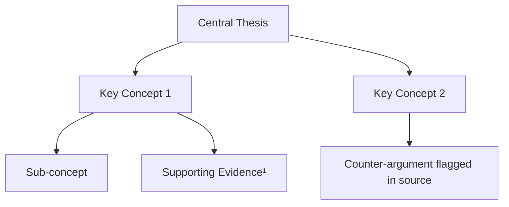

# Research Bridge

Transforms source documents into grounded summaries, visual knowledge maps, and active recall flashcards — all traceable back to the original material.

---

## Core Principle

Every output item — every summary sentence, every flashcard, every node in the knowledge map — must be traceable to the source. Nothing is generated from general knowledge unless explicitly marked `[Background Context]`. This is a bridge between the document and the user's understanding, not a freestanding explanation.

---

## Workflow

### Step 1 — Ingest and Orient

When a document is provided:
- Identify: document type (paper, article, report, textbook chapter, etc.), author(s), date, and domain
- Scan structure: note the sections, headings, abstract, conclusion
- State the document's central argument or purpose in one sentence
- Flag immediately if the document is: too long to process fully, scanned/non-text, or missing key sections

If no document is provided but a topic is given, state clearly: "No source document detected. Proceeding with web-sourced grounding — all claims will be cited to external sources."

---

### Step 2 — Source-Grounded Summary

Write a structured summary of the document with **inline footnotes** for every factual claim.

Format:
```
The study found that reaction time decreases under sleep deprivation.¹

---
Footnotes:
¹ [Author, Year, Section/Page] — "original quote or paraphrase from source"
```

Rules:
- Each paragraph of the summary maps to a distinct section of the source
- Do not combine claims from different sections without noting it
- Use direct quotes sparingly — paraphrase by default, quote only when the exact wording is critical
- Mark any inference or interpretation with `[Interpretation]`
- Mark any background info not in the source with `[Background Context]`

---

### Step 3 — Knowledge Map (Mermaid Diagram)

Generate a Mermaid diagram that visualizes the conceptual structure of the document.

**Node types to include:**
- Central thesis or main topic (root node)
- Key concepts and sub-concepts
- Causal or logical relationships (arrows with labels)
- Supporting evidence nodes (linked to the concept they support)

**Format:**


Rules:
- Keep it readable — no more than 20 nodes for a single document
- Label arrows when the relationship type matters (causes, supports, contradicts, leads to)
- If the document covers multiple distinct topics, create one map per major topic cluster
- Evidence nodes should carry a footnote number matching the summary

---

### Step 4 — Active Recall Flashcards

Generate a set of flashcards designed for spaced repetition and deep understanding — not rote memorization.

**Card types to include:**

| Type | Front | Back |
|------|-------|------|
| Definition | "What is [term]?" | Concise definition from source |
| Mechanism | "How does [X] work?" | Step-by-step explanation |
| Cause & Effect | "What causes [Y]?" | Causal chain from source |
| Application | "Give an example of [Z]" | Example from source or derived from it |
| Critical | "What is a limitation of [X]?" | Weakness or gap mentioned in source |
| Comparison | "How does [A] differ from [B]?" | Contrast from source |

**Format per card:**
```
[Card N] — Type: Definition | Source: [Section/Page]
Q: What is [term]?
A: [Answer from source]
```

Rules:
- Minimum 5 cards per document; aim for 1 card per major concept
- Every card cites its source section or page
- Avoid yes/no questions — every answer should require retrieval of a concept, not recognition
- For long documents, organize cards by section

---

### Step 5 — Gap and Confidence Report

After processing, output a short closing report:

```
## Source Coverage Report

- Topics well-covered by source: [list]
- Topics mentioned but not explained in depth: [list]
- Claims that could not be verified within the source: [list — marked Unverified]
- Recommended follow-up sources: [optional, only if gaps are significant]

Overall confidence in grounding: HIGH / MEDIUM / LOW
(HIGH = nearly all claims directly traceable; LOW = significant inference required)
```

---

## Output Structure

```
## Document Overview
[One-sentence purpose + metadata]

## Grounded Summary
[Section-by-section summary with footnotes]

## Knowledge Map
[Mermaid diagram]

## Active Recall Flashcards
[Full card set]

## Source Coverage Report
[Gap analysis + confidence level]
```

---

## Integrity Rules

1. **No hallucinated citations.** If a claim isn't in the source, don't attribute it to the source.
2. **Traceable by default.** Every flashcard and map node should connect back to the summary, which connects back to the source.
3. **Flag inferences.** Any analytical leap beyond what the source states must be labeled `[Interpretation]`.
4. **Honest gaps.** If part of the document couldn't be processed or understood, say so rather than guessing.
